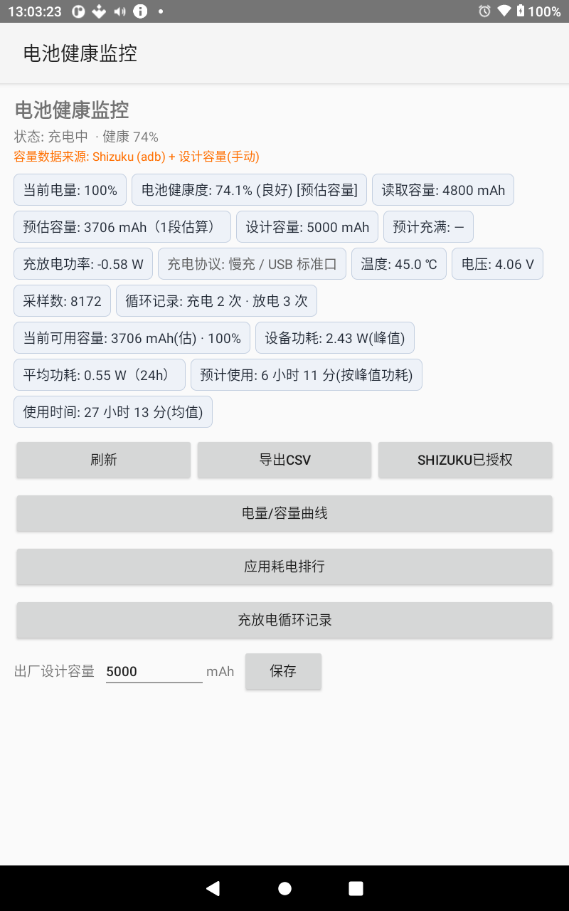
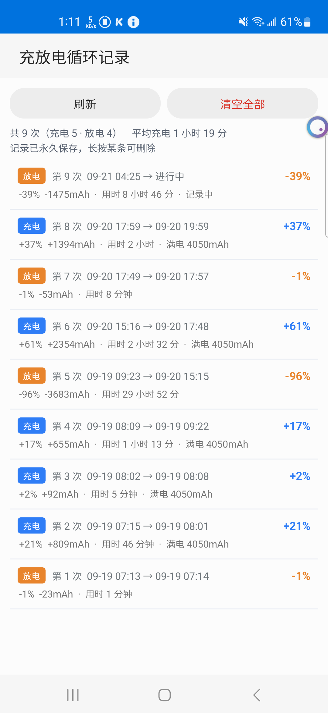
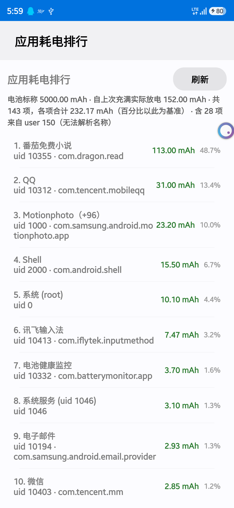

# Battery Monitor

Android 电池健康监控工具。持续采样电池状态，用库仑计（charge counter）估算**真实电池容量与健康度**，并记录每一次充放电循环。

- 包名：`com.batterymonitor.app`
- 最低系统：Android 8.0（API 26），目标 API 34
- 当前版本：v1.37（versionCode 38）
- 构建方式：**纯 Android SDK 命令行，不用 Gradle**

## 功能

| 功能 | 说明 |
|---|---|
| 电池健康度 | 预估容量 ÷ 设计容量。优先用 root（`su`）直读 sysfs，Shizuku(adb) 作为兜底，**root 读数不会被低权限来源覆盖** |
| 电量 / 容量曲线 | 独立图表页，单指拖动、双指缩放、双击复位，双图视口联动，带 24h/6h/1h 快捷范围 |
| 应用耗电排行 | 解析 `dumpsys batterystats --charged`，按 uid 汇总耗电并解析应用名 |
| 充放电循环记录 | 落库持久保存，按时间**统一编号**（第 N 次），只能手动删除 |
| 采样 | 前台服务每 30 秒采样一次，写入 SQLite |

## 截图

| 主页 | 循环记录 | 应用耗电 |
|---|---|---|
|  |  |  |

## 构建

前置：Android SDK（`C:\Android\Sdk`，需 build-tools 34.0.0 + platform android-34）、JDK 17 或 21、Python（用于注入 dex）。

```bat
build_apk.bat
```

产物 `battery-monitor.apk`。调试签名密钥 `debug.keystore` 不在仓库里，首次构建会自动生成（**仅供调试，正式发布请用自己的密钥**）。

若不想用脚本，等价的手工链路是：
`aapt2 compile` → `aapt2 link` → `javac --release 17` → 合并 Shizuku 类 → `jar` → `d8` → `inject_dex.py` → `zipalign -p 4` → `apksigner`。

## 目录结构

```
src/com/batterymonitor/app/   源码（19 个 java）
res/                          布局与资源
libs/                         Shizuku 依赖（shizuku-api / aidl / provider 13.1.5，aar）
AndroidManifest.xml
inject_dex.py                 把 classes.dex 注入未签名 APK
build_apk.bat                 一键构建
```

主要类：`MainActivity`（主页）、`BatteryData`（读数）、`Privileged`（root/Shizuku 双通道）、
`SamplingService`（采样服务）、`BatteryDbHelper`（SQLite）、`CycleRecorder`（循环归档）、
`ChartActivity` / `CycleActivity` / `AppPowerActivity`（三个专页）。

## 数据

SQLite 数据库 `battery.db`：

- `samples`：每 30 秒一条原始采样，**不可再生**，任何 schema 升级都不得 DROP
- `cycles`：充放电循环记录，与 samples 解耦，持久保存，只能手动删除

## 一些踩过的坑（改动前建议先看）

- **不要用匿名内部类 / lambda**：本项目用的 d8（R8 8.2.2-dev）转换时会内部 NPE。监听器写成命名类 `implements`，适配器用命名类 `extends BaseAdapter`。
- **后台线程必须整体 `try/catch(Throwable)`**：子线程未捕获异常会直接杀进程。
- **跨用户 uid 不能交给 `getPackagesForUid()`**：三星 Secure Folder 是 user 150，第三方应用访问会抛 `SecurityException`。判断用户用 `uid / 100000`（`UserHandle.getUserId` 是隐藏 API）。
- **解析 `dumpsys` 不能靠关键字大小写或缩进**：各 ROM 差异极大（耗电段可能是 `  UID `、`    UID ` 或 `    Uid `），只能靠**段落边界 + 首条匹配行的缩进**。用 `CASE_INSENSITIVE` 会把网络流量段误当成耗电段。
- **判断设备是否 root 不能只看 `adb shell su`**：KernelSU 一类方案只对已授权应用暴露 `su`，shell 里查不到。用 `pm list packages | grep -iE 'kernelsu|magisk|apatch'`。
- `Paint` 默认是 `FILL` 风格，画折线必须显式 `setStyle(STROKE)`，否则折线闭合填充成色块。

## License

MIT


---

<!-- coderabbit-smoke-test -->
## CodeRabbit 接入验证（临时）

本行由自动化流程于 2026-09-21 加入，仅用于触发一次 CodeRabbit 代码审查，以验证 GitHub App 接入是否真正生效。
验证完成后，本分支与对应 PR 会被关闭并删除，README 会还原。
